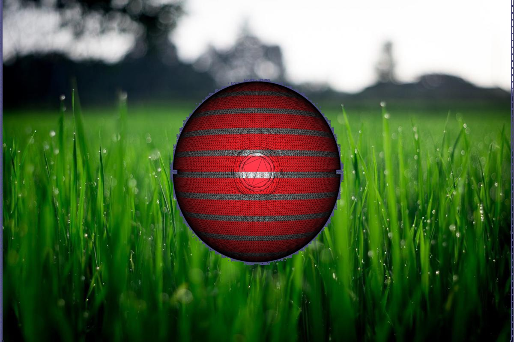

# CSC418-Computer Graphics – Final Image Competition

This repository contains the source code and output image for CSC418-Computer Graphics – Final Image Competition

  - Output.ppm is the output image
  - Source codes are under Project directory
  - Codes are generated and implement based on Assignment 1 and Assignment 5.
  - To generate the pokemon ball image, compile the code in LoadModel directory and run the obj executable
  - To generate the final image, copy the generated image from last steps to the directory under Main, compile the code in Main directory and run the raster executable

# Output.ppm

